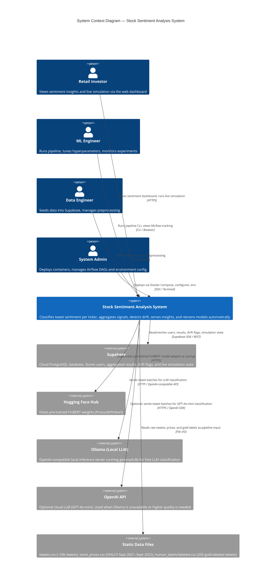
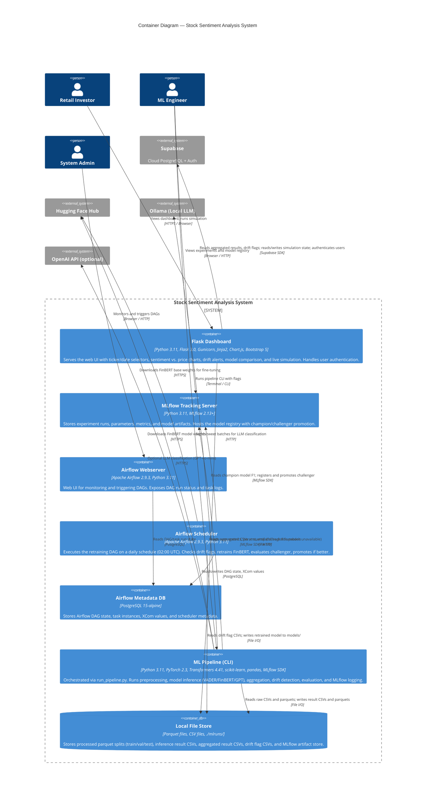
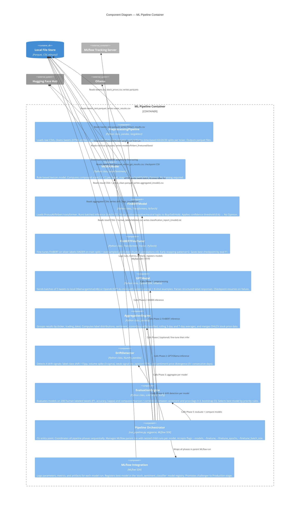
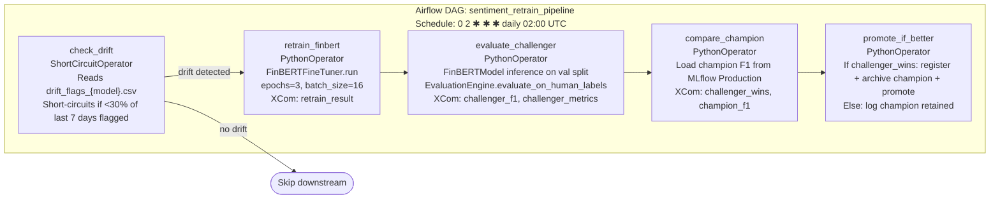
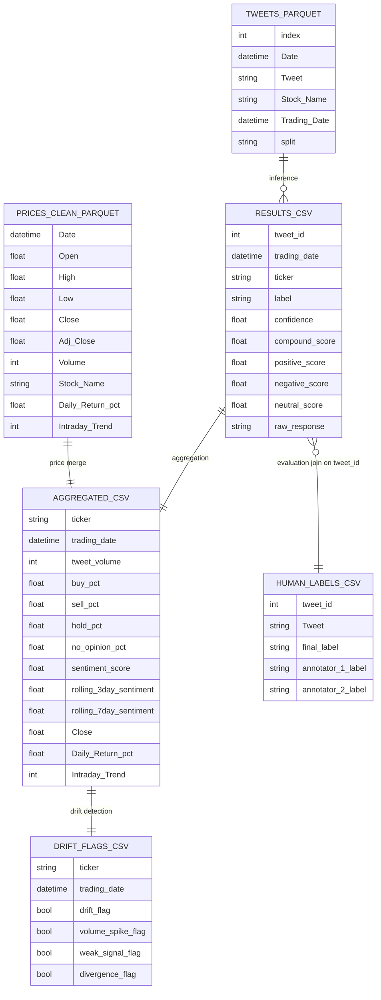

# C4 Architecture Diagram — Stock Sentiment Analysis System

> **System:** Stock Sentiment Analysis System  
> **Purpose:** End-to-end ML pipeline that classifies stock-related tweets (AAPL, TSLA, TSM) into sentiment signals (Buy/Hold/Sell/No Opinion), correlates them with price movements, detects data drift, and triggers automated retraining.

---

## Level 1 — System Context Diagram

Shows who uses the system and what external systems it depends on.



### Design Decisions & Trade-offs (Context Level)

| Decision | Rationale | Trade-off |
|----------|-----------|-----------|
| **Ollama as default LLM backend** | Zero API cost, runs locally, supports multiple open-source models | Slower inference (5–18 min vs. seconds), quality varies by model |
| **Supabase for cloud persistence** | Managed PostgreSQL with Auth and SDK — no infrastructure overhead | Requires internet; local fallback reads from CSV files |
| **Static CSV data source** | Historical dataset allows reproducible experiments and controlled evaluation | No live tweet ingestion; system is research/decision-support only |
| **Decision-support framing** | "Not financial advice" disclaimer prevents regulatory exposure | Limits productization potential |

---

## Level 2 — Container Diagram

Shows the major deployable units, their technologies, and how they communicate.



### Design Decisions & Trade-offs (Container Level)

| Decision | Rationale | Trade-off |
|----------|-----------|-----------|
| **File system as primary inter-container bus** | Simple, no broker overhead, suitable for batch pipeline with low throughput | No real-time streaming; containers must share a Docker volume or local mount |
| **MLflow as model registry** | Provides experiment tracking + model versioning in one tool with minimal setup | SQLite backend is not HA; needs migration to PostgreSQL for production scale |
| **Airflow for retraining orchestration** | Industry-standard scheduler with XCom, retry, and short-circuit operator support | Heavy dependency; overkill for a single daily DAG in research context |
| **Separate Airflow and Dashboard services** | Clean separation of concerns: orchestration vs. serving | Requires shared volume and synced model paths between containers |
| **Gunicorn in Dashboard container** | Multi-worker WSGI server for production readiness | Requires careful worker count tuning (CPU-bound workers for Flask) |
| **Local fallback for Supabase** | Dashboard remains functional when cloud is unreachable | Data may be stale; no live simulation without Supabase |

---

## Level 3 — Component Diagram (ML Pipeline Only)

Shows the internal components of the `ML Pipeline` container and how they interact.



### Design Decisions & Trade-offs (Component Level)

| Decision | Rationale | Trade-off |
|----------|-----------|-----------|
| **Three-model ensemble approach** | Each model has different strengths: VADER (fast/free), FinBERT (domain-specific), GPT (contextual reasoning) | EvaluationEngine picks one winner — ensemble voting not implemented |
| **Silver + Gold label fine-tuning** | Gold labels are scarce (200 tweets); VADER provides cheap silver labels for the full train split | Silver labels are noisy; VADER bias may propagate into fine-tuned FinBERT |
| **Time-based split (no random shuffle)** | Prevents temporal data leakage — a model trained on Sept data shouldn't see Aug data in test | Smaller effective training set; no cross-validation across time folds |
| **Confidence threshold → No Opinion** | Prevents FinBERT from forcing a label when uncertain | Threshold (0.6) is empirically chosen; may need calibration per dataset |
| **GPT checkpoint-resume** | LLM inference is slow (5–18 min); partial results are saved every batch | Checkpoint file must be manually cleared between fresh pipeline runs |
| **DriftDetector as separate component** | Modular: drift signals are computed post-aggregation and can trigger Airflow independently | Thresholds (15pp, 3-sigma, 35%) are fixed constants — not learned from data |
| **EvaluationEngine priority table** | Deterministic model selection avoids human bias in champion selection | Priority rules may not generalize; Pearson r significance is not gated |

---

## Level 4 — Code Diagram (ML Components Only)

Shows the key classes, methods, and data structures within the ML components.

### 4.1 Class Structure

```mermaid
classDiagram

    class PreprocessingPipeline {
        +str data_dir
        +str processed_dir
        +run() dict
        -_load_prices() DataFrame
        -_load_tweets() DataFrame
        -_clean_tweet(text: str) str
        -_is_english(text: str) bool
        -_split(df: DataFrame) tuple
    }

    class VADERModel {
        +str processed_dir
        +int batch_size
        +run(mlflow_parent_run_id: str) DataFrame
        -_classify_batch(texts: list) list~tuple~
        -_map_label(compound: float, token_count: int) tuple~str, float~
    }

    class FinBERTModel {
        +str model_name_or_path
        +int batch_size
        +float confidence_threshold
        +str model_key
        +str device
        +run(mlflow_parent_run_id: str) DataFrame
        -_classify_batch(texts: list) list~dict~
        -_load_model() void
    }

    class FinBERTFineTuner {
        +str processed_dir
        +str output_dir
        +run(epochs: int, batch_size: int) dict
        -_build_training_df() DataFrame
        -_compute_metrics(eval_pred) dict
    }

    class _TweetDataset {
        +dict encodings
        +list labels
        +__len__() int
        +__getitem__(idx: int) dict
    }

    class GPTModel {
        +int batch_size
        +float temperature
        +int max_retries
        +str ollama_model
        +str ollama_base_url
        +run(mlflow_parent_run_id: str) DataFrame
        -_call_api(tweets: list) tuple
        -_parse_response(text: str, n: int) list~str~
        -_build_user_message(tweets: list) str
    }

    class AggregationEngine {
        +str processed_dir
        +run(results_df: DataFrame, model_name: str) DataFrame
        -_compute_label_distribution(group) Series
        -_compute_sentiment_score(group) float
        -_merge_prices(agg_df: DataFrame) DataFrame
    }

    class DriftDetector {
        +run(aggregated_df: DataFrame, model_name: str) DataFrame
        -_drift_flag(df: DataFrame) Series
        -_volume_spike_flag(df: DataFrame) Series
        -_weak_signal_flag(df: DataFrame) Series
        -_divergence_flag(df: DataFrame) Series
    }

    class EvaluationEngine {
        +evaluate_on_human_labels(results_df, labels_csv, model_name) dict
        +evaluate_sentiment_price_correlation(aggregated_df, model_name, n_bootstrap) dict
        +compare_models(metrics: dict) str
        +inter_model_agreement(*result_dfs, model_names) DataFrame
        -_bootstrap_pearson(x, y, n) tuple~float, float~
    }

    FinBERTFineTuner ..> _TweetDataset : creates
    FinBERTFineTuner ..> FinBERTModel : instantiates after training
```



### 4.2 ML Pipeline Data Flow

```mermaid
flowchart TD
    subgraph Input["Input Layer"]
        A[(tweets.csv\n~53k tweets\nSept 2021–Sept 2022)]
        B[(stock_prices.csv\nOHLCV per ticker)]
        C[(human_labels/lebeled.csv\n200 gold-labeled tweets)]
    end

    subgraph Preproc["PreprocessingPipeline"]
        D[Load & clean tweets\nHTML, URLs, non-English, dedup]
        E[Time-based split\n60% train / 20% val / 20% test\nper ticker — no shuffle]
        F[(tweets_train.parquet\ntweets_val.parquet\ntweets_test.parquet\nprices_clean.parquet)]
    end

    subgraph Inference["Inference Layer — 3 Models Run in Sequence"]
        G[VADERModel\ncompound score → label\nbatch=1000, ~5s]
        H[FinBERTModel\nsoftmax argmax → label\nthreshold=0.6, batch=32]
        I[FinBERTFineTuner\nsilver labels VADER +\ngold labels x5\nepochs=3, early_stop patience=2]
        J[GPTModel\n8-shot prompt → label\nbatch=5, retry=3, checkpoint]
        K[FinBERTModel\nfine-tuned path\nbatch=32]
    end

    subgraph Results["Result CSVs"]
        L[(vader_results.csv)]
        M[(finbert_results.csv)]
        N[(finbert_finetuned_results.csv)]
        O[(gpt_results.csv)]
    end

    subgraph Agg["AggregationEngine — per model"]
        P[Group by ticker + trading_date\nCompute: buy/sell/hold/no_opinion pct\nsentiment_score = buy-sell/classified\nRolling 3-day & 7-day averages]
        Q[(aggregated_vader.csv\naggregated_finbert.csv\naggregated_gpt.csv)]
    end

    subgraph Drift["DriftDetector — per model"]
        R{drift_flag\n>15pp class shift}
        S{volume_spike_flag\nvolume > mean+3σ}
        T{weak_signal_flag\nno_opinion > 35%}
        U{divergence_flag\nsentiment↔price 5+ days}
        V[(drift_flags_{model}.csv)]
    end

    subgraph Eval["EvaluationEngine"]
        W[evaluate_on_human_labels\nF1 macro/weighted, accuracy\nprecision, recall, Cohen's Kappa]
        X[evaluate_sentiment_price_correlation\nPearson r, p-value\n95% bootstrap CI — n=1000\nlags 0-3 per ticker + combined]
        Y[compare_models\nPriority: F1>0.5 → Pearson r → no_opinion rate → agreement → cost]
        Z[inter_model_agreement\npairwise agreement rate]
    end

    subgraph MLflow["MLflow Tracking"]
        AA[parent_run: pipeline_run_timestamp]
        AB[child_run: vader]
        AC[child_run: finbert]
        AD[child_run: finbert_finetuned]
        AE[child_run: gpt4o_mini]
        AF[Model Registry: stock_sentiment_classifier\nNone → Production → Archived]
    end

    A --> D
    B --> D
    D --> E
    E --> F

    F --> G
    F --> H
    F --> I
    F --> J
    I -->|saves best checkpoint| K

    G --> L
    H --> M
    K --> N
    J --> O

    L --> P
    M --> P
    N --> P
    O --> P
    P --> Q

    Q --> R & S & T & U
    R & S & T & U --> V

    L & M & N & O --> W
    C --> W
    Q --> X
    W & X --> Y
    L & M & N & O --> Z
    Z --> Y

    Y -->|best_model| AF
    AA --> AB & AC & AD & AE
    AB -.->|logs params/metrics| G
    AC -.->|logs params/metrics| H
    AD -.->|logs params/metrics| K
    AE -.->|logs params/metrics| J
```

### 4.3 Airflow Retraining DAG



### 4.4 Key Data Schemas



### 4.5 Model Selection Logic

```
EvaluationEngine.compare_models(metrics: dict) → str

Priority Rules (applied in order):
┌─────────────────────────────────────────────────────────────────────┐
│ 1. GATE: Weighted F1 > 0.50                                         │
│    → Models below threshold are eliminated from consideration        │
│                                                                     │
│ 2. Highest |Pearson r| (combined ticker, any lag 0-3)               │
│    → Measures alignment between sentiment signal and price movement  │
│                                                                     │
│ 3. Lowest no_opinion_rate                                           │
│    → Fewer abstentions = more actionable signal                     │
│                                                                     │
│ 4. Highest inter-model agreement rate (pairwise)                    │
│    → Agreement with other models = more reliable prediction         │
│                                                                     │
│ 5. Lowest cost (tie-breaker)                                        │
│    VADER ($0) < FinBERT ($0) < GPT (~$5-15)                        │
└─────────────────────────────────────────────────────────────────────┘

Drift Thresholds (DriftDetector):
  drift_flag:         |label_class_pct - 7day_rolling_mean| > 0.15 (15pp)
  volume_spike_flag:  tweet_volume > rolling_mean + 3 × rolling_std
  weak_signal_flag:   no_opinion_pct > 0.35
  divergence_flag:    sign(sentiment_score) ≠ sign(daily_return) for 5+ consecutive days
```

---

## Architecture Summary

### Key Design Decisions

| Layer | Decision | Justification |
|-------|----------|---------------|
| **Data** | Time-based split, no shuffle | Prevents temporal leakage — training on future data to predict past is invalid for financial signals |
| **ML** | Three independent models (VADER, FinBERT, GPT) | Complementary strengths; rule-based baseline vs. domain-specific transformer vs. general-purpose LLM |
| **ML** | Silver + Gold fine-tuning | Bootstraps fine-tuning from 200 gold labels by augmenting with VADER-labeled silver data |
| **ML** | Confidence threshold for "No Opinion" | Reduces false signals from low-confidence FinBERT predictions |
| **Serving** | Champion/Challenger via MLflow registry | Automated promotion only if challenger exceeds champion F1 — guards against regressions |
| **Orchestration** | Airflow short-circuit on low drift | Avoids unnecessary retraining cost when data distribution is stable |
| **Infrastructure** | Docker Compose + shared volumes | Self-contained local deployment; reproducible across environments |
| **Persistence** | Dual path: Supabase cloud + local CSV | Resilient; system runs offline; Supabase adds multi-user and live simulation support |

### ML Trade-offs Summary

| Trade-off | Chosen Approach | Alternative Not Taken |
|-----------|----------------|----------------------|
| Speed vs. quality | Three separate models evaluated independently | Ensemble voting (would improve accuracy but hide model transparency) |
| Data quantity vs. correctness | Silver labels from VADER for fine-tuning | Manual annotation of full dataset (cost-prohibitive for 53k tweets) |
| Drift thresholds | Fixed statistical constants | Learned thresholds from historical drift windows |
| Evaluation scope | Test split + 200 human labels | Full cross-validation (not possible with time-series data and small gold set) |
| LLM cost | Ollama local by default | OpenAI cloud API (higher quality, higher cost, latency) |
